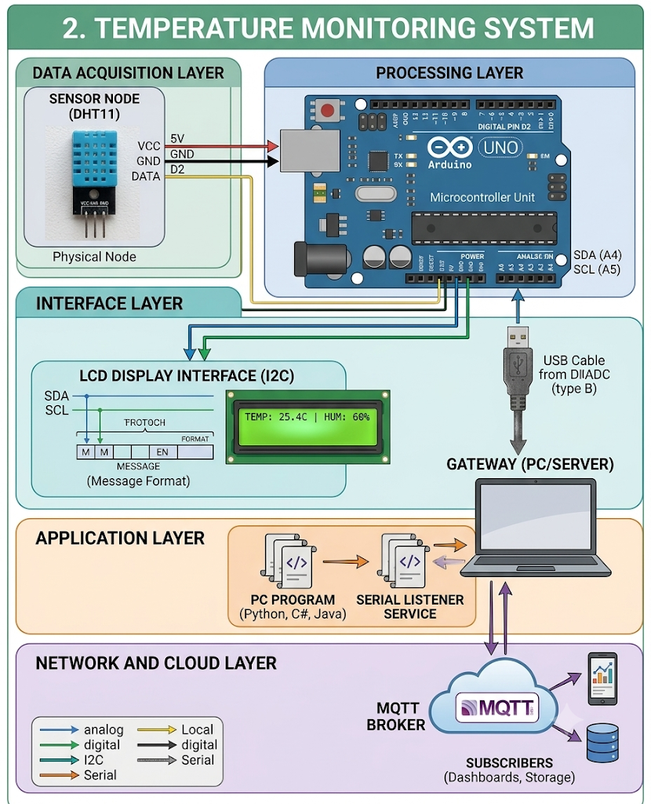

# 🌡 IoT Real-Time Temperature Monitoring System


---

## 🚀 Live Demo

👉 **Real-Time Dashboard:**  
http://157.173.101.159:9243/

---

## 📌 Overview

This project is a complete **end-to-end IoT system** that collects real-world temperature data, processes it on a server, stores it, and visualizes it in real time through a web dashboard.

It demonstrates full-stack integration between:
- IoT hardware
- MQTT communication
- Backend server processing
- Database storage
- Frontend visualization

---

## ⚙️ System Architecture


---

## 🔥 Features

- 📡 Real-time temperature data collection
- ☁ MQTT-based IoT communication
- 🗄 Persistent SQLite database storage
- 🌐 REST API for data access
- 📊 Live dashboard with auto-refresh
- 📈 Temperature history visualization
- 🔁 Continuous background data streaming
- 🌍 Remote server deployment (Ubuntu VPS)

---

## 🛠 Tech Stack

**Backend:**
- Python
- Flask
- Paho MQTT

**Frontend:**
- HTML5
- CSS3
- JavaScript
- Chart.js

**Database:**
- SQLite

**Deployment:**
- Ubuntu Server
- nohup process manager

---

## 📡 API Endpoints

| Endpoint | Description |
|----------|------------|
| `/api/current` | Latest temperature reading |
| `/api/history` | Last 30 recorded readings |

---

## 🌍 Deployment Info

- Server: Ubuntu VPS
- Public IP: `157.173.101.159`
- Port: `9243`

---

## 📸 Dashboard Preview

> Live system updates every few seconds with real-time temperature tracking.

---

## 🚀 How to Run Locally

```bash
cd python
python3 app.py

---

## 🔥 Features

- 📡 Real-time temperature data collection
- ☁ MQTT-based IoT communication
- 🗄 Persistent SQLite database storage
- 🌐 REST API for data access
- 📊 Live dashboard with auto-refresh
- 📈 Temperature history visualization
- 🔁 Continuous background data streaming
- 🌍 Remote server deployment (Ubuntu VPS)

---

## 🛠 Tech Stack

**Backend:**
- Python
- Flask
- Paho MQTT

**Frontend:**
- HTML5
- CSS3
- JavaScript
- Chart.js

**Database:**
- SQLite

**Deployment:**
- Ubuntu Server
- nohup process manager

---

## 📡 API Endpoints

| Endpoint | Description |
|----------|------------|
| `/api/current` | Latest temperature reading |
| `/api/history` | Last 30 recorded readings |

---

## 🌍 Deployment Info

- Server: Ubuntu VPS
- Public IP: `157.173.101.159`
- Port: `9243`

---

## 📸 Dashboard Preview

> Live system updates every few seconds with real-time temperature tracking.

---

## 🚀 How to Run Locally

```bash
cd python
python3 app.py

